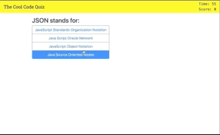

# Cool. Code. Quiz!

## Description

This is a coding quiz that presents 10 questions in a ascending weight (first question is worth 10, the last is worth 100). After the alloted time (60 seconds), or all questions are answered, the user is presented with a modal to enter their initials if it falls within the top 10\. The high scores are stored locally. The high scores page displays the 10 ten scores from the locally stored quiz results.

## Images

### Demo:

## Link

You can find the deployed application [here](https://nobleburgundy.github.io/jcg-coding-quiz/).
